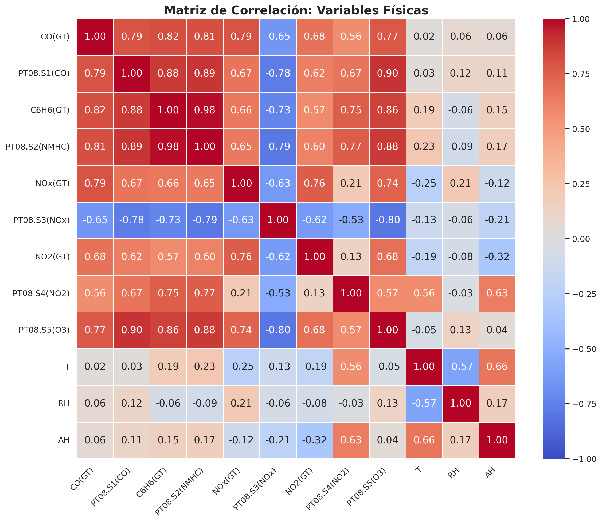
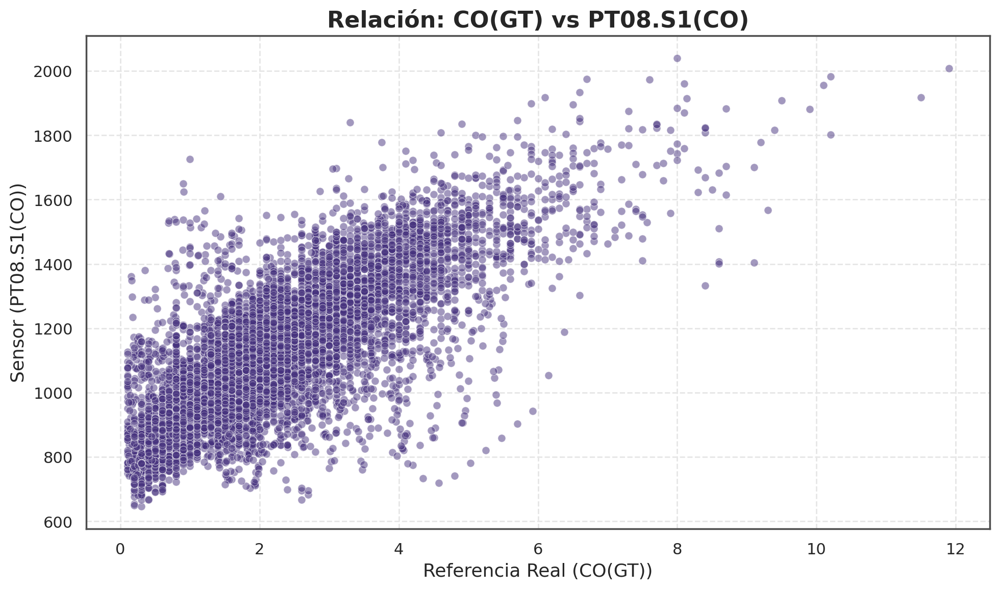
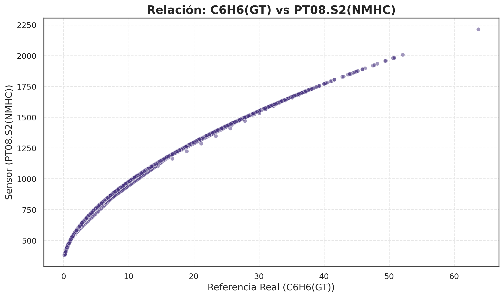
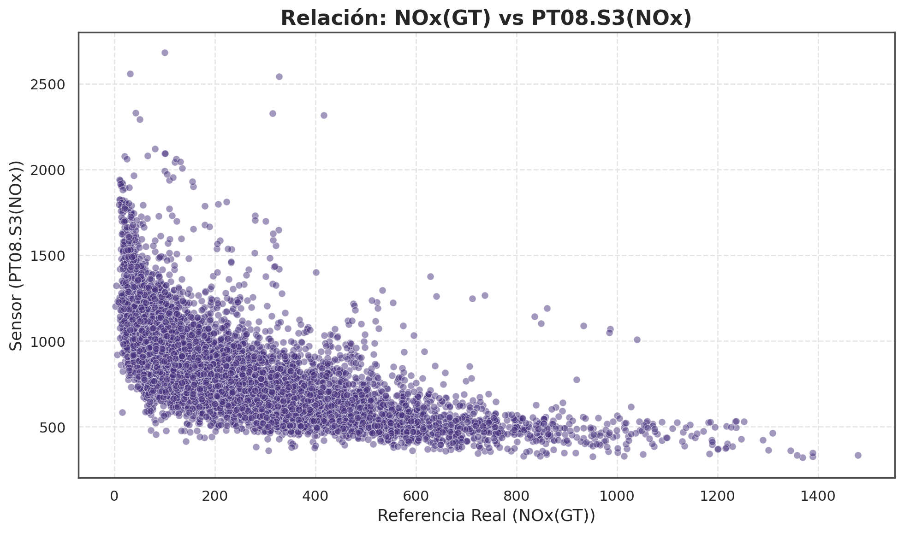
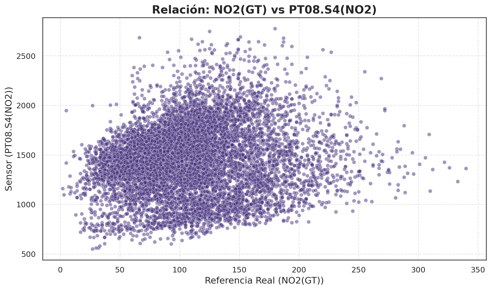

# Laboratorio 3: Observación de Calidad del Aire

## Descripción del Proyecto
Análisis exploratorio y limpieza de datos de calidad del aire del dataset UCI Air Quality. El objetivo es procesar datos con valores perdidos utilizando técnicas de interpolación temporal, considerando la naturaleza física (log-normal) de las variables.

## Metodología

### 1. Carga y Limpieza Inicial
Se cargó el CSV `AirQualityUCI.csv` con configuración:
- Delimitador: `;` (punto y coma)
- Decimales: `,` (coma)
- Valores perdidos: `-200` (código UCI para missing values)

Operaciones realizadas:
- Eliminación de columnas completamente nulas
- Eliminación de filas completamente nulas
- Identificación de columnas con valores perdidos

### 2. Ingeniería de Características Temporales
Se creó la columna `DateTime` combinando `Date` y `Time` con formato `%d/%m/%Y %H.%M.%S`. 

Variables derivadas agregadas:
- `dia`: Día de la semana (Monday, Tuesday, ..., Sunday)
- `hora`: Hora de medición (0-23)
- `mes`: Mes (1-12)
- `fin_de_semana`: Indicador booleano de fin de semana

El índice del DataFrame se cambió a `DateTime` para facilitar operaciones temporales.

### 3. Análisis de Datos Perdidos

#### Porcentaje de Valores Perdidos por Variable

| Variable | Missing % |
|----------|-----------|
| Date | 0.0% |
| Time | 0.0% |
| CO(GT) | 17.99% |
| PT08.S1(CO) | 3.91% |
| NMHC(GT) | **90.23%** |
| C6H6(GT) | 3.91% |
| PT08.S2(NMHC) | 3.91% |
| NOx(GT) | 17.52% |
| PT08.S3(NOx) | 3.91% |
| NO2(GT) | 17.55% |
| PT08.S4(NO2) | 3.91% |
| PT08.S5(O3) | 3.91% |
| T | 3.91% |
| RH | 3.91% |
| AH | 3.91% |

#### Observaciones Clave sobre Distribuciones

Las variables físicas presentan dos tipos de distribuciones:

**Distribución Log-Normal (sesgo positivo, cola derecha):**
- Contaminantes gaseosos: `CO(GT)`, `NOx(GT)`, `C6H6(GT)` (Benceno)
- Sensores correspondientes: `PT08.S1(CO)`, `PT08.S3(NOx)`, `PT08.S2(NMHC)`, `PT08.S5(O3)`
- **Característica:** Valores concentrados cerca de cero con cola larga hacia valores altos

**Distribución Normal (Gaussiana, simétrica):**
- Variables ambientales: `T` (Temperatura), `RH` (Humedad Relativa), `AH` (Humedad Absoluta)
- Contaminante reactivo: `NO2(GT)` y sensor `PT08.S4(NO2)`
- **Característica:** Distribución simétrica alrededor de la media

A continuación, ejemplos representativos de **distribuciones log-normales**:

**Histograma CO(GT) - Sesgo positivo característico:**


**Boxplot NOx(GT) - Presencia de outliers por cola derecha:**


**Histograma NO2(GT) - Distribución log-normal:**


**Boxplot PT08.S1(CO) - Estructura típica de datos log-normales:**


### 4. Tratamiento de Valores Perdidos
Se aplicó **interpolación temporal** aprovechando la estructura de series temporales:

```python
df_air_quality_UCI[columns_with_missing_values] = df_air_quality_UCI[columns_with_missing_values].interpolate(method='time')
df_air_quality_UCI[columns_with_missing_values] = df_air_quality_UCI[columns_with_missing_values].bfill().ffill()
```

**Justificación:** Entre dos mediciones válidas (ej: 11:00 CO(GT)=1.2 y 13:00 CO(GT)=1.4), el valor de las 12:00 debe interpolarse linealmente en tiempo, no usar mediana (que sería 1.3, pero sin base temporal).

Pasos:
1. Interpolación lineal temporal: estima valores intermedios basados en progresión temporal
2. Forward/Backward Fill: rellena discontinuidades en extremos o series fragmentadas

### 5. Análisis de Correlaciones y Relaciones Sensor-Referencia

#### Nota sobre NMHC(GT) y PT08.S4(NO2)
- **NMHC(GT)** fue excluido por tener **90.23% de datos perdidos**, haciéndolo inviable incluso con imputación.
- **PT08.S4(NO2)** exhibe **alta sensibilidad** a variaciones ambientales, resultando en correlaciones más reactivas.
- **PT08.S3(NOx)** presenta **alta dispersión** ("nube") en scatter plots debido a variables confusoras (temperatura, humedad); no es un error de medición sino una característica que requiere **calibración multivariable** en aplicaciones reales.
- Para análisis de **hidrocarburos no metálicos**, se utilizó **C6H6(GT) (Benceno)** como proxy, ya que es el hidrocarburo no metálico más similar disponible en el dataset.

#### Matriz de Correlación - Variables Físicas



#### Relaciones Sensor-Referencia (Pares Pareados)

**Monóxido de Carbono (CO):**


**Hidrocarburos No Metálicos (Benceno):**


**Óxidos de Nitrógeno (NOx):**


**Dióxido de Nitrógeno (NO2):**


## Salida
- **Dataset procesado:** `Data/processed/air_quality_UCI_cleaned.csv`
- **Porcentajes de missing values:** `Data/raw/missing_data/missing_percentages.csv`
- **Visualizaciones:**
  - Distribuciones: `Data/raw/missing_data/distribuciones/`
  - Correlaciones: `Data/raw/figures/`
